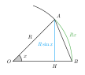

## Острые углы

{: .w7 }

Пусть угол $x$ находится в промежутке $[0, \frac{\pi}{2}]$. Рассмотрим окружность радиуса $R$ с центром в точке $O$. На окружности отметим две точки $A$ и $B$, такие, что угол между $OA$ и $OB$ равен $x$.

Сторона $AH$ является катетом в треугольнике $ABH$, поэтому она меньше гипотенузы $AB$.

$$ AH < AB $$

||| spoiler Доказательство

По теореме Пифагора:

$$ AB^2 = AH^2 + HB^2 > AH^2 \\ AB^2 > AH^2 $$

Берем корень от обеих частей неравенства. Знак модуля не нужен, так как $AB$ и $AH$ больше $0$:

$$ AB > AH $$

$\blacksquare$

|||

Так как длина отрезка $AB$ является кратчайшим расстоянием между точками $A$ и $B$, то его длина меньше, чем длина дуги $\widetilde{AB}$, которую он стягивает.

$$ AH < AB < \widetilde{AB} $$

$$ AH < \widetilde{AB} $$

По определению, синус угла $x$ равен отношению противолежащего катета $AH$ к гипотенузе $OA = R$:

$$ \sin x = \frac{AH}{R} $$

$$ AH = R\sin x $$

Длина дуги $\widetilde{AB}$ в радианах равна:

$$ \widetilde{AB} = xR $$

Подставляем найденные значения $AH$ и $\widetilde{AB}$ в неравенство выше:

$$ R\sin x < Rx $$

Делим обе части на положительное $R$:

$$ \sin x < x $$

Не забываем, что при $x=0$ имеем $\sin x = x = 0$ поэтому:

$$ \sin x \leq x $$

$\blacksquare$

## Общий случай

Итак, для $x$ в промежутке $[0, \frac{\pi}{2}]$:

$$ \sin x \leq x $$

В этом промежутке и синус, и $x$ не являются отрицательными числами, поэтому:

$$ \sin x = |\sin x| \qquad x = |x| $$

Поэтому для рассматриваемого промежутка выполняется:

$$ |\sin x| \leq |x| $$

Для $x$ в промежутке $[-\frac{\pi}{2}, 0)$ можно использовать те же рассуждения, что и для острых углов, но с учетом того, что

$$ AH = |\sin x| \qquad \widetilde{AB} = |x| $$

$$ |\sin x| \leq |x| $$

Итак, для $x$ в промежутке $[-\frac{\pi}{2}, \frac{\pi}{2}]$ выполняется неравенство:

$$ |\sin x| \leq |x| $$

Пусть теперь $x$ лежит в промежутке $(-\infty, -\frac{\pi}{2})\ \cup \ (\frac{\pi}{2}, +\infty)$. Этот факт можно выразить следующим выражением:

$$ \orcases{x > \frac{\pi}{2} \\ x < -\frac{\pi}{2}} $$

По прото-задаче <p:[simple-abs]> выражение сверху можно представить так:

$$ \orcases{x > \frac{\pi}{2} \\ x < -\frac{\pi}{2}} \Leftrightarrow |x| > \frac{\pi}{2} $$

Тогда:

$$ |\sin x| \leq 1 < \frac{\pi}{2} < |x| \\ |\sin x| < |x| $$

Итак, мы доказали, что для любого вещественного $x$ выполняется неравенство:

$$ |\sin x| \leq |x| $$

$\blacksquare$