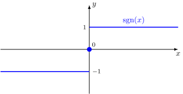

График функции:

 {: .w8 }

---

Докажем, что

$$ |x| = x\sgn x $$

Пусть $x>0$, тогда $|x|=x$ и $\sgn x = 1$:

$$ x = x\cdot 1 $$

$$ x = x $$

Пусть $x = 0$, тогда $|x| = 0$ и $\sgn x = 0$:

$$ 0 = 0 \cdot 0 $$

Пусть $x < 0$, тогда $|x| = -x$ и $\sgn x = -1$:

$$ -x = x \cdot (-1) $$

$$ -x = -x $$

$\blacksquare$