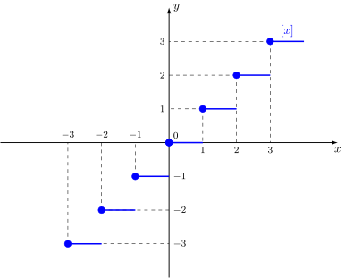

Во первых, из определения функции целой части числа для любого целого $x$ выполняется $y=[x] = x$.

Поэтому, к графику функции целой части числа будут относиться все точки прямой $y=x$ с целочисленными координатами.

Теперь перейдем к дробной части. Рассмотрим, например $x=1.2$. По определению функции целой части $y = [1.2] = 1$.
Точно такой же результат получим для $1.3, 1.5, 1.999$. Короче говоря, любой $x$ между $1$ и $2$ будет равняться $1$.

Получающийся график чем-то похож на лестницу:

