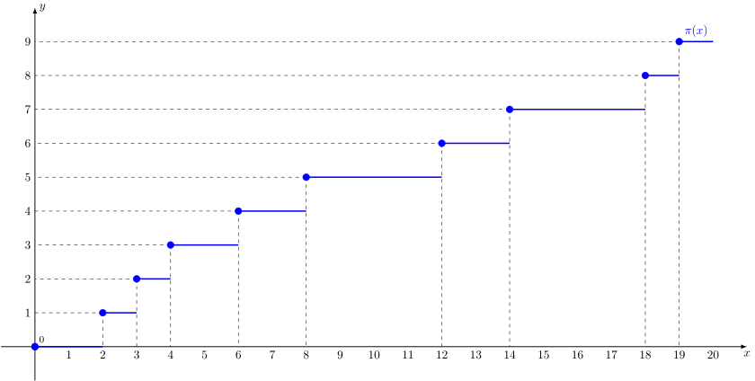

При $x$ от $0$ до $2$ (не включая) простых чисел, которые меньше $x$ нет. ($1$ не является простым числом)

При $x$ от $2$ до $3$ есть одно простое число: $2$.

При $x$ от $3$ до $4$ есть два простых числа: $2$ и $3$.

При $x$ от $4$ до $6$ есть 3 простых числа: $2,3$ и $5$.

И так далее до $20$.

График:

